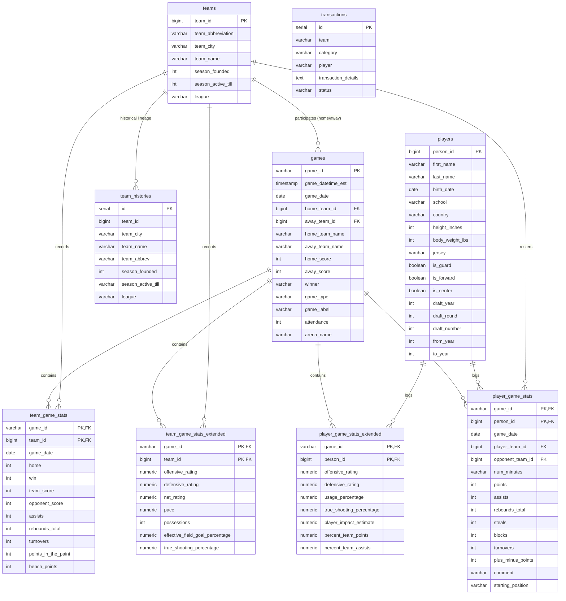

# Lakers in 5 — Hybrid Data Architecture & Database Design Document

This document details the hybrid data architecture (Parquet/DuckDB Analytical Lake + Neon PostgreSQL Serving Database), relational table specifications, indexing strategy, data lineage mappings, and temporal leakage guardrails for the **Lakers in 5** production ML/MLOps data layer.

---

## 0. Hybrid Storage Architecture

To achieve zero data loss while respecting cloud database free-tier storage boundaries (512 MB quota), the project employs a tiered hybrid storage design:

```
                               ┌──────────────────────────────────────────────┐
                               │       data/raw/ (Immutable Raw CSVs)         │
                               │  73k Games, 146k Team Stats, 1.67M Players   │
                               └──────────────────────┬───────────────────────┘
                                                      │
                                                      ▼
                      ┌───────────────────────────────────────────────────────────────┐
                      │            ANALYTICAL LAKEHOUSE (DuckDB / Parquet)            │
                      │                    data/processed/parquet/                    │
                      │                                                               │
                      │  • Full 1946–2026 Player Statistics (1.67M rows) in Parquet   │
                      │  • Full Extended Tracking Metrics (838k rows) in Parquet      │
                      │  • Complete Match & Team Box-Scores in Parquet (73k/146k rows)│
                      │  • Fast Vectorized SQL queries via DuckDB                     │
                      │  • Foundation for upcoming Phase 2 Feature Engineering        │
                      └──────────────────────┬────────────────────────────────────────┘
                                             │
                                             ▼
                      ┌───────────────────────────────────────────────────────────────┐
                      │       [UPCOMING PHASES 2 & 3] FEATURES & ML MODEL PIPELINE    │
                      │            Feature Engineering → XGBoost / LightGBM           │
                      │          Predicting Upcoming Lakers Game Outcomes             │
                      └──────────────────────┬────────────────────────────────────────┘
                                             │
                                             ▼
                      ┌───────────────────────────────────────────────────────────────┐
                      │            SERVING DATABASE LAYER (Neon PostgreSQL)           │
                      │                   (Total Footprint: ~50 MB)                   │
                      │                                                               │
                      │  CURRENT (Phase 1 Implemented):                               │
                      │  • Dimension Entities (teams, players, transactions, history) │
                      │  • Match Catalog & Team Box Scores (games, team_game_stats)   │
                      │                                                               │
                      │  PLANNED (Phase 3/4 Upcoming Serving Tables):                 │
                      │  • Model Prediction Results & Inference Serving Logs          │
                      │  • FastAPI / Web Backend Serving Tables                       │
                      └───────────────────────────────────────────────────────────────┘
```

---

## 0.1. Games Discrepancy & Synthetic Parent Backfill (194 Records)

* **Source File `Games.csv`:** 73,279 official NBA regular season and playoff games.
* **Database `games` Table:** 73,473 rows (**+194 records**).

### Root Cause & Justification
`PlayerStatistics.csv` contains box score logs referencing 194 exhibition, preseason (codes starting with `1...`), and All-Star games (codes starting with `3...`) that were omitted from `Games.csv`. In a normalized relational schema with foreign key constraints, loading player statistics without these parent game records would trigger foreign key integrity violations (`violates foreign key constraint games_fkey`).

### How Synthetic Parent Games Are Reconstructed & Distinguished
During ingestion (`src/ingestion/load_games.py`), if an unlisted `game_id` is encountered in `PlayerStatistics.csv`, a minimal parent record is synthesized using metadata from the player log:
* `game_id`, `game_datetime_est`, `game_date`, `game_type` (e.g. `'Exhibition'`, `'All-Star'`, `'Pre Season'`), `game_label`, `game_sub_label`, `series_game_number`.
* `home_team_id`, `away_team_id`, `home_score`, `away_score`, `winner`, `arena_id` are set to `NULL`.

### Reproducible Identification in SQL
All 194 synthetic parent records can be deterministically queried and distinguished from official source games using:
```sql
-- Query synthetic parent records
SELECT game_id, game_date, game_type 
FROM games 
WHERE home_team_id IS NULL AND away_team_id IS NULL;
```
For ML training and feature engineering on official match outcomes, feature pipelines strictly filter on official games (`WHERE home_team_id IS NOT NULL AND away_team_id IS NOT NULL`).

---

## 1. Entity-Relationship (ER) Architecture



---

## 2. Relational Schema Specifications

### 2.1. `teams` (Dimension)
* **Description:** Canonical registry of all NBA franchises across league history.
* **Primary Key:** `team_id` (`BIGINT`)
* **Key Columns:** `team_abbreviation`, `team_city`, `team_name`, `season_founded`, `season_active_till`, `league`.

### 2.2. `players` (Dimension)
* **Description:** Player biographical metadata, draft records, and position eligibility.
* **Primary Key:** `person_id` (`BIGINT`)
* **Key Columns:** `first_name`, `last_name`, `birth_date`, `school`, `country`, `height_inches`, `body_weight_lbs`, `jersey`, `is_guard`, `is_forward`, `is_center`, `draft_year`, `draft_round`, `draft_number`, `from_year`, `to_year`.

### 2.3. `games` (Fact / Ground Truth Target)
* **Description:** Individual game matchups, official scores, locations, and outcome targets.
* **Primary Key:** `game_id` (`VARCHAR(50)`)
* **Foreign Keys:** `home_team_id -> teams(team_id)`, `away_team_id -> teams(team_id)`
* **Key Columns:** `game_datetime_est`, `game_date`, `home_team_city`, `home_team_name`, `away_team_city`, `away_team_name`, `home_score`, `away_score`, `winner`, `game_type`, `game_label`, `attendance`, `arena_name`, `officials`.

### 2.4. `team_game_stats` (Fact)
* **Description:** Traditional box score metrics per team per game. Exactly 2 records per completed game.
* **Primary Key:** Composite `(game_id, team_id)`
* **Foreign Keys:** `game_id -> games(game_id)`, `team_id -> teams(team_id)`, `opponent_team_id -> teams(team_id)`
* **Key Columns:** `home`, `win`, `team_score`, `opponent_score`, `assists`, `blocks`, `steals`, `field_goals_made/attempted`, `three_pointers_made/attempted`, `free_throws_made/attempted`, `rebounds_defensive/offensive/total`, `turnovers`, `plus_minus_points`, `q1_points`–`q4_points`, `bench_points`, `points_in_the_paint`, `points_fast_break`, `lead_changes`.

### 2.5. `team_game_stats_extended` (Fact)
* **Description:** Advanced possession and tracking analytics per team per game (1996–present).
* **Primary Key:** Composite `(game_id, team_id)`
* **Foreign Keys:** `game_id -> games(game_id)`, `team_id -> teams(team_id)`
* **Key Metrics:** `offensive_rating`, `defensive_rating`, `net_rating`, `pace`, `possessions`, `effective_field_goal_percentage`, `true_shooting_percentage`, `assist_to_turnover_ratio`, `offensive_rebound_percentage`, `defensive_rebound_percentage`, `free_throw_attempt_rate`, `player_impact_estimate`.

### 2.6. `player_game_stats` (Fact)
* **Description:** Individual player box score performance and game participation.
* **Primary Key:** Composite `(game_id, person_id)`
* **Foreign Keys:** `game_id -> games(game_id)`, `person_id -> players(person_id)`, `player_team_id -> teams(team_id)`
* **Key Columns:** `points`, `assists`, `rebounds_total`, `steals`, `blocks`, `turnovers`, `field_goals_made/attempted`, `three_pointers_made/attempted`, `free_throws_made/attempted`, `plus_minus_points`, `num_minutes`, `comment` (captures DNP reasons), `starting_position`.

### 2.7. `player_game_stats_extended` (Fact)
* **Description:** Advanced player impact, usage share, and tracking metrics (1996–present).
* **Primary Key:** Composite `(game_id, person_id)`
* **Foreign Keys:** `game_id -> games(game_id)`, `person_id -> players(person_id)`
* **Key Metrics:** `usage_percentage`, `offensive_rating`, `defensive_rating`, `net_rating`, `true_shooting_percentage`, `effective_field_goal_percentage`, `player_impact_estimate`, `percent_team_points`, `percent_team_assists`, `percent_team_rebounds`, `percent_assisted_2point_made`, `percent_unassisted_2point_made`.

### 2.8. `transactions` (Dimension / Event Log)
* **Description:** Player transactions (signings, trades, waivers, extensions) going into the 2026–27 season.
* **Primary Key:** `id` (`SERIAL`)
* **Key Columns:** `team`, `category`, `player`, `transaction_details`, `status`.

### 2.9. `team_histories` (Dimension)
* **Description:** Historical franchise lineage and city relocations.
* **Primary Key:** `id` (`SERIAL`)
* **Key Columns:** `team_id`, `team_city`, `team_name`, `team_abbrev`, `season_founded`, `season_active_till`, `league`.

---

## 3. Indexing Strategy

Targeted B-Tree indexes are deployed in [`src/ingestion/sql/02_create_indexes.sql`](file:///c:/Users/anime/Desktop/work/Lakers%20in%205/src/ingestion/sql/02_create_indexes.sql) to optimize the subsequent feature-engineering workload:

| Index Name | Table | Columns | Optimized Access Pattern |
| :--- | :--- | :--- | :--- |
| `idx_games_date` | `games` | `(game_date)` | Time-sliced queries, chronologically ordered train/test splits |
| `idx_games_datetime` | `games` | `(game_datetime_est)` | Timestamp filtering and rest-day calculations |
| `idx_games_home_away` | `games` | `(home_team_id, away_team_id)` | Head-to-head historical matchup aggregations |
| `idx_team_stats_team_date` | `team_game_stats` | `(team_id, game_date)` | Rolling N-game team form calculations |
| `idx_team_stats_ext_team` | `team_game_stats_extended` | `(team_id)` | Advanced efficiency rating joins |
| `idx_player_stats_person_date` | `player_game_stats` | `(person_id, game_date)` | Player rolling minutes, scoring, and form trends |
| `idx_player_stats_team` | `player_game_stats` | `(player_team_id, game_date)` | Team roster availability rollups |
| `idx_player_stats_ext_person`| `player_game_stats_extended` | `(person_id)` | Advanced player impact queries |

---

## 4. Architectural Decisions on Excluded / Specialized Datasets

1. **Seasonal Aggregates (`Regular_Season.csv`, `Playoffs.csv`, `nba.csv`):**
   * *Decision:* Excluded from core relational database tables.
   * *Rationale:* These datasets are season-level aggregated summaries across 2012–2024. Ingesting season-level sums alongside granular game-by-game logs would cause severe data duplication and schema confusion. All seasonal metrics can be dynamically reproduced with complete temporal precision directly from `player_game_stats`.
2. **Schedule PDFs (`2026-27-NBA-Regular-Season-Schedule-*.pdf`):**
   * *Decision:* Retained in `data/raw/schedules/` until a dedicated schedule parser is built in Phase 2.
   * *Rationale:* Preserves raw document integrity and avoids injecting unverified or partial schedule data into PostgreSQL.

---

## 5. Temporal Data Leakage Prevention

> [!CAUTION]
> **Cardinal Rule of Sports Modeling:**
> Historical game statistics are **post-game information** and must **NEVER** be directly used as features for predicting that same game.

### Strict Enforcement Principles
* When generating features for a target matchup on date $T$ (e.g. `2026-01-20 Lakers vs Denver`), all feature queries must strictly execute:
  ```sql
  WHERE game_date < '2026-01-20'
  ```
* Any game occurring on or after date $T$, as well as player statistics recorded in that game, are strictly forbidden in the feature set.
* Automated integration tests ([`tests/test_integrity.py`](file:///c:/Users/anime/Desktop/work/Lakers%20in%205/tests/test_integrity.py)) verify this temporal boundary condition.
